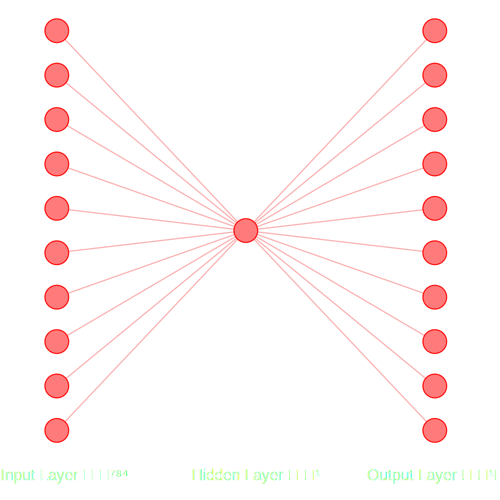
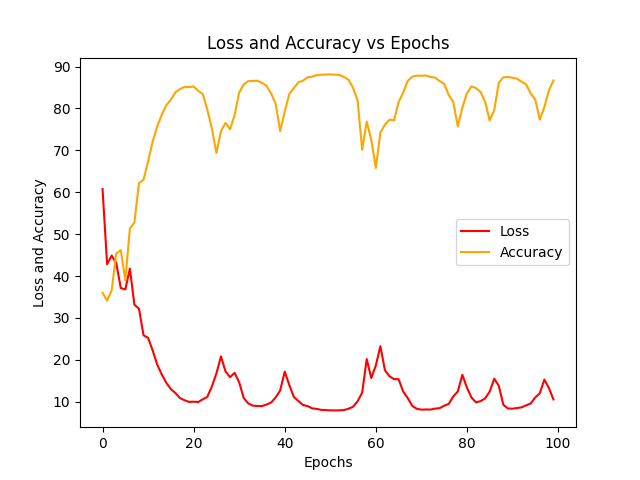

# NMIST Neural Network

This repository contains a severals neural network that can recognize handwritten digits from the MNIST dataset. Neural networks are either made from scratch using only the **numpy** library, either build with frameworks like **TensorFlow** or **PyTorch**.

## Summary

### 1. [Simple Perceptron](#1---simple-perceptron)

### 2. [Deep Neural Network](#2---multi---layer-neural-network)

### 3. [Convolutional Neural Network](#3---convolutional-neural-network)

### 4. [AlexNet](4---alexnet)

### 5. [Performance Comparison](#5---performance-comparison)

## 1 - Simple Perceptron

For this first neural network, we will use a single neuron to classify the MNIST dataset. The input layer of the network will have 784 neurons, each one representing the grayscale value of a pixel of the 28x28 image. Then, all the neurons of the input layer will be connected to a single neuron in the hidden layer. Finally, the output layer will have 10 neurons, each one representing a digit from 0 to 9.

The activation function used in this network is the ReLU function. The loss function is the mean squared error. The network will be trained using the gradient descent algorithm.

Here is the architecture of the network:

And here's what the loss and precision curves roughly look like for the 3 versions of the network:

 

## 5 - Performance Comparison

### Here are tables comparing the performance of the different frameworks depending on the neural network used:

- Simple Perceptron.

| Framework  | Accuracy | Training Time | Epochs | Learning Rate |
| ---------- | -------- | ------------- | ------ | ------------- |
| Vanilla    | ~90%     | ~30s          | 100    | 0.01          |
| Pytorch    | ~90%     | ~0.35s        | 100    | 0.01          |
| TensorFlow |          |               | 100    | 0.01          |

- Deep Neural Network.

| Framework  | Accuracy | Training Time | Epochs | Learning Rate |
| ---------- | -------- | ------------- | ------ | ------------- |
| Vanilla    |          |               | 100    | 0.01          |
| Pytorch    |          |               | 100    | 0.01          |
| TensorFlow |          |               | 100    | 0.01          |

- Convolutional Neural Network.

| Framework  | Accuracy | Training Time | Epochs | Learning Rate |
| ---------- | -------- | ------------- | ------ | ------------- |
| Vanilla    |          |               | 100    | 0.01          |
| Pytorch    |          |               | 100    | 0.01          |
| TensorFlow |          |               | 100    | 0.01          |

- AlexNet.

| Framework  | Accuracy | Training Time | Epochs | Learning Rate |
| ---------- | -------- | ------------- | ------ | ------------- |
| Vanilla    |          |               | 100    | 0.01          |
| Pytorch    |          |               | 100    | 0.01          |
| TensorFlow |          |               | 100    | 0.01          |

### Here are tables comparing the performance of the different neural networks depending on the framework used:

- Neural Network built from scratch using only **numpy**.

| Framework         | Accuracy | Training Time | Epochs | Learning Rate |
| ----------------- | -------- | ------------- | ------ | ------------- |
| Simple Perceptron | ~90%     | ~30s          | 100    | 0.01          |
| DNN               |          |               | 100    | 0.01          |
| CNN               |          |               | 100    | 0.01          |
| AlexNet           |          |               | 100    | 0.01          |

- Neural Network built with **PyTorch**.

| Neural Network    | Accuracy | Training Time | Epochs | Learning Rate |
| ----------------- | -------- | ------------- | ------ | ------------- |
| Simple Perceptron | ~90%     | ~0.35s        | 100    | 0.01          |
| DNN               |          |               | 100    | 0.01          |
| CNN               |          |               | 100    | 0.01          |
| AlexNet           |          |               | 100    | 0.01          |

- Neural Network built with **TensorFlow**.

| Neural Network    | Accuracy | Training Time | Epochs | Learning Rate |
| ----------------- | -------- | ------------- | ------ | ------------- |
| Simple Perceptron |          |               | 100    | 0.01          |
| DNN               |          |               | 100    | 0.01          |
| CNN               |          |               | 100    | 0.01          |
| AlexNet           |          |               | 100    | 0.01          |
