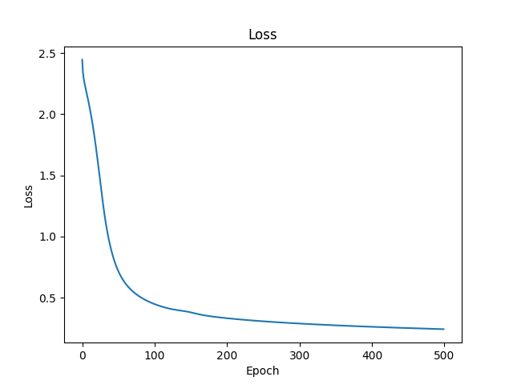

# NMIST Neural Network

This repository contains a severals neural network that can recognize handwritten digits from the MNIST dataset. Neural networks are either made from scratch using only the **CuPy** library, either build with the frameworks **PyTorch**.

> **Note**: The MNIST dataset is a dataset of 60,000 small square 28x28 pixel grayscale images of handwritten single digits between 0 and 9. The dataset also includes a test set of 10,000 images.  
> CuPy is an open-source array library accelerated with NVIDIA CUDA. It allows you to perform operations on a GPU. It is a drop-in replacement for NumPy.  
> TensorFlow was not used in this project because I couldn't find a way to make it work with my GPU.

## Summary

### 1. [Linear Classifier](#1---linear-classifier)

### 2. [Deep Neural Network](#2---deep-neural-network)

### 3. [Convolutional Neural Network](#3---convolutional-neural-network)

### 4. [LeNet](4---LeNet)

### 5. [Performance Comparison](#5---performance-comparison)

## 1 - Linear Classifier

For this first neural network, we will directly plug the input layer to the output layer. This means that we will not have any hidden layers. The input layer of the network will have 784 neurons, each one representing the grayscale value of a pixel of the 28x28 image. Then, all the neurons of the input layer will be connected to all the neurons of the output layer. Finally, the output layer will have 10 neurons, each one representing a digit from 0 to 9.

The activation function used in this network is the ReLU function. The network will be trained using the gradient descent algorithm.

Here is the architecture of the network:

    

> **Note**: Input layer: 784 neurons. Output layer: 10 neurons.

And here's what the loss and precision curves roughly look like for both versions of the network:

 

    

## 2 - Deep Neural Network

For this second neural network, we will add 3 hidden layers to the previous architecture. The input layer will still have 784 neurons, and the output layer will still have 10 neurons.

The activation function and the training algorithm used in this network are the same as in the previous one. The only other notable difference is that the initialization of the weights is done using the He method. This method is used to initialize the weights of the network in order to avoid the vanishing gradient problem.

Here is the architecture of the network:

    

> **Note**: Layers (including input and output layers): 784-32-32-10 neurons.

And here's what the loss and precision curves roughly look like for both versions of the network:

 

    

## 5 - Performance Comparison

### Here are tables comparing the performance of the different frameworks depending on the neural network used:

- Linear Classifier

| Framework | Accuracy | Training Time | Epochs | Learning Rate | Number of weights | Number of biases | Device |
| :-------: | :------: | :-----------: | :----: | :-----------: | :---------------: | :--------------: | :----: |
|  Vanilla  |   ~88%   |      ~6s      |  100   |       1       |       7840        |        10        |  GPU   |
|  Pytorch  |   ~88%   |     ~0.3s     |  100   |       1       |       7840        |        10        |  GPU   |

- Deep Neural Network

| Framework | Accuracy | Training Time | Epochs | Learning Rate | Number of weights | Number of biases | Device |
| :-------: | :------: | :-----------: | :----: | :-----------: | :---------------: | :--------------: | :----: |
|  Vanilla  |   ~93%   |     ~50s      |  500   |      0.1      |       26432       |        74        |  GPU   |
|  Vanilla  |   ~93%   |               |  500   |      0.1      |       26432       |        74        |  GPU   |

- Convolutional Neural Network

| Framework | Accuracy | Training Time | Epochs | Learning Rate | Number of weights | Number of biases | Device |
| :-------: | :------: | :-----------: | :----: | :-----------: | :---------------: | :--------------: | :----: |
|  Vanilla  |          |               |  100   |               |       7840        |                  |  GPU   |
|  Pytorch  |          |               |  100   |               |       7840        |                  |  GPU   |

- LeNet

| Framework | Accuracy | Training Time | Epochs | Learning Rate | Number of weights | Number of biases | Device |
| :-------: | :------: | :-----------: | :----: | :-----------: | :---------------: | :--------------: | :----: |
|  Vanilla  |          |               |  100   |               |       7840        |                  |  GPU   |
|  Pytorch  |          |               |  100   |               |       7840        |                  |  GPU   |

### Here are tables comparing the performance of the different neural networks depending on the framework used:

- Neural Network built from scratch using only **CuPy**

|     Framework     | Accuracy | Training Time | Epochs | Learning Rate | Number of weights | Number of biases | Device |
| :---------------: | :------: | :-----------: | :----: | :-----------: | :---------------: | :--------------: | :----: |
| Linear Classifier |   ~88%   |      ~6s      |  100   |       1       |       7840        |        10        |  GPU   |
|        DNN        |   ~93%   |     ~50s      |  500   |      0.1      |       26432       |        74        |  GPU   |
|        CNN        |          |               |  100   |               |                   |                  |  GPU   |
|       LeNet       |          |               |  100   |               |                   |                  |  GPU   |

- Neural Network built with **PyTorch**

|  Neural Network   | Accuracy | Training Time | Epochs | Learning Rate | Number of weights | Number of biases | Device |
| :---------------: | :------: | :-----------: | :----: | :-----------: | :---------------: | :--------------: | :----: |
| Linear Classifier |   ~88%   |     ~0.3s     |  100   |       1       |       7840        |        10        |  GPU   |
|        DNN        |   ~93%   |               |  500   |      0.1      |       26432       |        74        |  GPU   |
|        CNN        |          |               |  100   |               |                   |                  |  GPU   |
|       LeNet       |          |               |  100   |               |                   |                  |  GPU   |

> **Note**: These values can change depending on the version of Python and your PC  
> For these benchmarks, I used Python 3.12.4 64-bit implemented with CPython on a Ryzen 5 3600, rtx 2060 with 2\*8GB of RAM clocked at 3600Hz on Windows 10.
