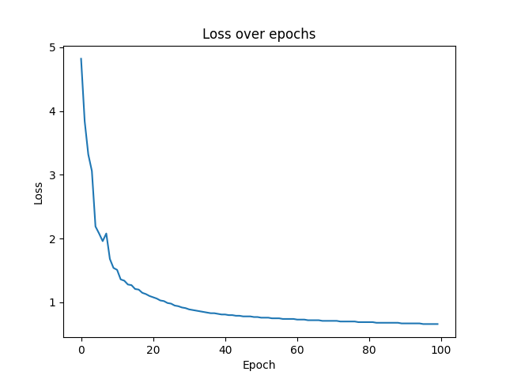

# NMIST Neural Network

This repository contains a severals neural network that can recognize handwritten digits from the MNIST dataset. Neural networks are either made from scratch using only the **numpy** library, either build with frameworks like **TensorFlow** or **PyTorch**.

## Summary

## 1. [Single neuron network](#1---single-neuron-network)

### &nbsp;&nbsp;&nbsp;&nbsp;&nbsp; I. [Single neuron from scratch](#I.-single-neuron-from-scratch)

### &nbsp;&nbsp;&nbsp;&nbsp;&nbsp; II. [Single neuron with PyTorch](#)

### &nbsp;&nbsp;&nbsp;&nbsp;&nbsp; III. [Single neuron with TensorFlow](#)

### 2. [Multi-layer Neural Network](#2---multi---layer-neural-network)

### &nbsp;&nbsp;&nbsp;&nbsp;&nbsp; I. [MLNN from scratch](#)

### &nbsp;&nbsp;&nbsp;&nbsp;&nbsp; II. [MLNN with PyTorch](#)

### &nbsp;&nbsp;&nbsp;&nbsp;&nbsp; III. [MLNN with TensorFlow](#)

### 3. [Conventional Neural Network](#3---conventional-neural-network)

### &nbsp;&nbsp;&nbsp;&nbsp;&nbsp; I. [CNN from scratch](#)

### &nbsp;&nbsp;&nbsp;&nbsp;&nbsp; II. [CNN with PyTorch](#)

### &nbsp;&nbsp;&nbsp;&nbsp;&nbsp; III. [CNN with TensorFlow](#)

### 4. [AlexNet](4---alexnet)

### &nbsp;&nbsp;&nbsp;&nbsp;&nbsp; I. [AlexNet from scratch](#)

### &nbsp;&nbsp;&nbsp;&nbsp;&nbsp; II. [AlexNet with PyTorch](#)

### &nbsp;&nbsp;&nbsp;&nbsp;&nbsp; III. [AlexNet with TensorFlow](#)

## 1 - Single neuron network

For this first neural network, we will use a single neuron to classify the MNIST dataset. The input layer of the network will have 784 neurons, each one representing the grayscale value of a pixel of the 28x28 image. Then, all the neurons of the input layer will be connected to a single neuron in the hidden layer. Finally, the output layer will have 10 neurons, each one representing a digit from 0 to 9.

The activation function used in this network is the ReLU function. The loss function is the mean squared error. The network will be trained using the gradient descent algorithm.

Here is the architecture of the network:

  

 

### &nbsp;&nbsp;&nbsp;&nbsp;I. Single neuron from scratch

On my computer, the network was able to reach an average accuracy of 90% on the test set after 100 epochs and a learning rate of 0.01. The training time was around 30 seconds.

Here's what the loss and accuracy curves look like:

